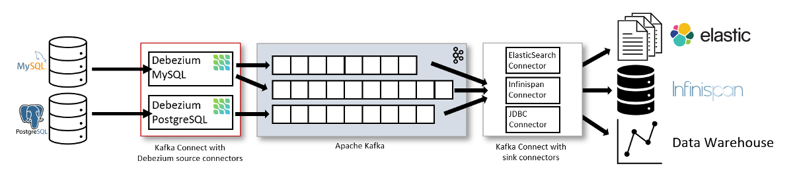

# DEBEZIUM

---

## Введение

**Debezium** — ПО, которое умеет отслеживать изменения в базе данных (такой подход называют **CDC — Change Data Capture**) и передавать эти изменения дальше.

По сути, это набор «коннекторов» (специальных модулей) для разных баз данных, которые работают вместе с **Apache Kafka Connect**. Поддерживаются базы: MySQL, PostgreSQL, MongoDB, SQL Server.

Вместо того чтобы периодически выгружать данные из базы (например, каждые 5 минут), Debezium позволяет в реальном времени фиксировать вставки, обновления и удаления строк и транслировать их в виде событий в Kafka. Таким образом, любые изменения в источнике данных можно сразу использовать в других системах.

**Плюсы такого подхода**:

* данные приходят почти в реальном времени (низкая задержка);
* высокая надежность и доступность за счёт кластера Kafka;
* единый формат событий (приложению всё равно, какая база используется);
* легко масштабировать — можно подключать сколько угодно потребителей изменений;
* минимальная нагрузка на саму базу данных (чтение идёт не напрямую, а из Kafka).

---

## Архитектура

Архитектура конвейера захвата данных в Debezium основана на взаимодействии нескольких компонентов:

* СУБД, выступающие источником данных;
* коннекторы, которые отслеживают изменения в соответствующих им базах данных, например, коннектор для MySQL использует клиентскую библиотеку для доступа к журналу бинарных логов (binlog);
* Kafka Connect обрабатывает данные, поступающие от коннекторов, и передает их брокеру Kafka;
* брокер записывает данные в тему Kafka, при необходимости можно настроить преобразование маршрутизации тем. После этого записанные данные могут передаваться в другие системы.

Основная схема использования выглядит так:

***СУБД (как источник данных) → коннектор в Kafka Connect → Apache Kafka → консьюмер***

Однако, наполнение Data Lake (последний элемент в схеме) - не единственный способ применения Debezium. События, отправленные в Apache Kafka, могут использоваться приложениями в различных ситуациях. Например:

- удаление неактуальных данных из кэша;
- отправка уведомлений;
- обновления поисковых индексов;
- некое подобие логов аудита;
- и тд.

---

## Пример

Если в PostgreSQL добавлена строка в таблицу `users`, Debezium зафиксирует это в WAL (write-ahead log), создаст событие в Kafka, например в топике `dbserver1.public.users`, и передаст информацию о новой записи. Аналогично фиксируются обновления и удаления.

### Зачем нужен

* Для интеграции систем в режиме реального времени.
* Для построения потоковых ETL-процессов.
* Для синхронизации между разными хранилищами данных.
* Для уменьшения нагрузки по сравнению с регулярными batch-загрузками.

---

### Использованные ресурсы

[Знакомство с Debezium — CDC для Apache Kafka](https://habr.com/ru/companies/flant/articles/523510/)
[Что такое Debezium и для чего используется](https://gitverse.ru/blog/articles/data/253-chto-takoe-debezium-i-dlya-chego-ispolzuetsya)