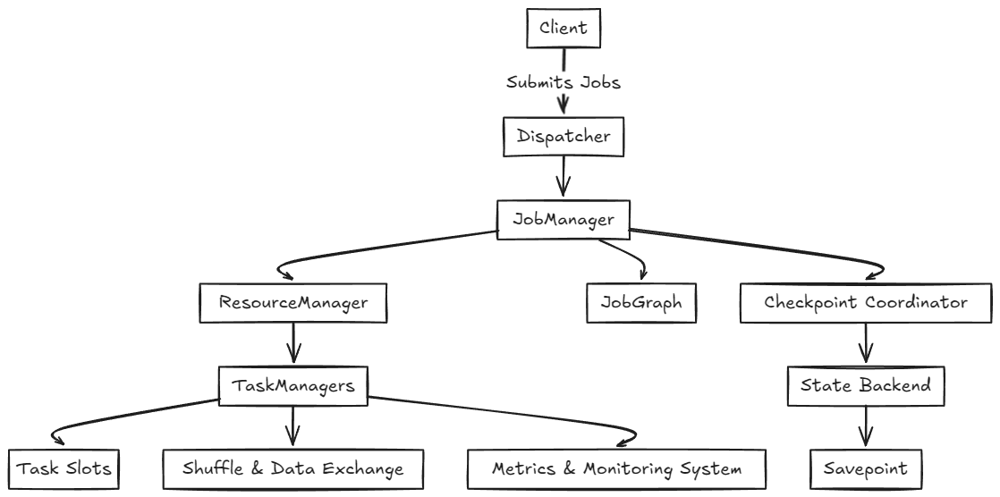
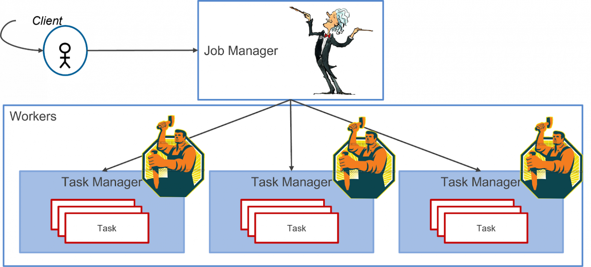
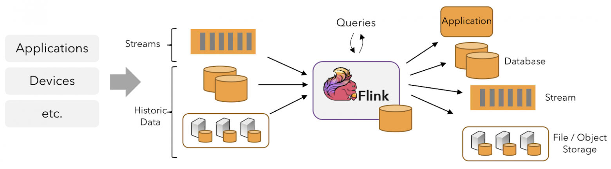

# FLINK

---

## Введение

**Apache Flink** — это распределенный движок обработки данных, поддерживающий как пакетную (ограниченную), так и потоковую (неограниченную)обработку данных. Это значит, что с его помощью можно обрабатывать как статичные (неизменяемые) данные, так и данные, поступающие в реальном времени.

Фреймворк обладает следующими основными особенностями.

- Обработка данных происходит построчно. Это играет важную роль в скорости обработки данных.

- Поддерживаемые языки программирования ㅡ Java, Scala, Python.

- Можно использовать расширенные оконные функции. Оконные функции позволяют разделить поток на сегменты ㅡ окна — и проводить операции над данными в рамках каждого окна.

- Можно реализовать подход exactly-once (строго однократная доставка, когда каждое входящее событие влияет на результат только один раз). Есть ограничение: источник и получатель данных тоже должны поддерживать подход exactly-once.

---

## Архитектура Flink

Система Flink состоит из следующих компонентов:

- Dispatcher. Получает описание задачи от клиента или другого компонента системы, который хочет запустить задачу в Flink. Предоставляет REST API для запуска задач в Flink.

- Job Manager. Управляет выполнением задач, их планированием и распределением. Выполняет операции, такие как создание чекпоинтов и восстановление приложения после сбоев.

- Resource Manager. Координирует ресурсы, взаимодействует с внешними провайдерами, масштабирует приложение при необходимости.

- Task Manager. Выполняет задачи, управляет их состоянием и сообщает метрики в Job Manager.

- JobGraph. Представляет абстрактное описание вычислительного задания в Flink, которое включает последовательность этапов обработки данных и зависимости между ними. Он определяет, какие операции нужно выполнить и в какой последовательности.

- Checkpoint Coordinator. Управляет созданием чекпоинтов (автоматических точек восстановления).

- Savepoint. Точка восстановления, созданная по инициативе пользователя. Позволяет сохранить текущее состояние задачи, например перед обновлением или изменением конфигурации.

- State Backend. Хранит состояние задачи и управляет им, поддерживает различные механизмы хранения и управления состоянием. Это может быть хранение в памяти или на диске, с использованием различных технологий и систем для хранения данных.

- Task Slots. Единицы, которые определяют, сколько задач может одновременно выполнять TaskManager. Каждое задание (или его часть) назначается на слот для выполнения. Количество слотов в TaskManager ограничивает параллельность — количество задач, которые могут быть обработаны одновременно этим узлом.

- Shuffle и Data Exchange. Оптимизированный обмен данными между задачами. Включает передачу данных между различными этапами обработки.

- Client. Интерфейс для отправки и мониторинга задач через CLI, REST API или клиентскую библиотеку.

- Metrics и Monitoring System. Система для сбора и мониторинга метрик задач и ресурсов (интегрируется с инструментами по типу Prometheus и Grafana).

*Архитектура Flink*

**Основные компоненты**

Apache Flink разворачивается с помощью двух компонентов: Job Manager и Task Manager. 

Job Manager ㅡ это оркестратор, центральный компонент архитектуры Apache Flink, отвечающий за координацию распределённого исполнения приложения. Job manager выполняет множество задач:

* планирует выполнение задач;

* реагирует на выполнение задач или ошибки в процессе выполнения;

* координирует checkpoints ㅡ механизм периодического резервного сохранения состояния на случай сбоя;

* координирует восстановление после сбоев.

Task Manager ㅡ это основной рабочий процесс в архитектуре Apache Flink, он отвечает за выполнение конкретной задачи.

*Job и Task Manager*

---

## Как работает Flink

Верхнеуровневое изображение процесса обработки

*Обработка с помощью Flink*

Приложение на основе фреймворка считывает данные из различных источников. Источниками могут выступать неограниченные потоки в реальном времени из приложений, устройств и брокеров сообщений и ограниченные потоки из баз данных, файловых  хранилищ. 

Внутри приложение формирует направленный ациклический граф (DAG). Каждый узел графа отвечает за выполнение какой-либо операции над данными (сортировка, фильтрация, вычисления и т. д.). Направленный граф может быть представлен в двух видах: логический и физический. 

Логический граф показывает какие операции будут проведены над данными. В логическом графе узлы называются операторами (operator). Физический граф ㅡ преобразованный для выполнения логический граф. В физическом графе каждый оператор может быть представлен несколькими задачами (Task). Задачи могут выполняться как параллельно, так и последовательно.

После обработки приложение может отправить результаты получателям (Sink): в другие потоки для последующей обработки, в базы данных, хранилища и т. д.

Apache Flink позволяет реализовывать как Stateless, так и Stateful-приложения. Для обеспечения Stateful-вычислений в Apache Flink существует компонент Состояние (State).  Состояние ㅡ это слепок данных на конкретный момент времени. State хранится в оперативной памяти (in-memory), что позволяет максимально ускорить вычисления. 

---

### Использованные ресурсы

[Стриминговые фреймворки: Apache Flink](https://habr.com/ru/articles/840300/)

[Apache Flink для начинающих: архитектура, библиотеки и применение](https://habr.com/ru/articles/914836/)