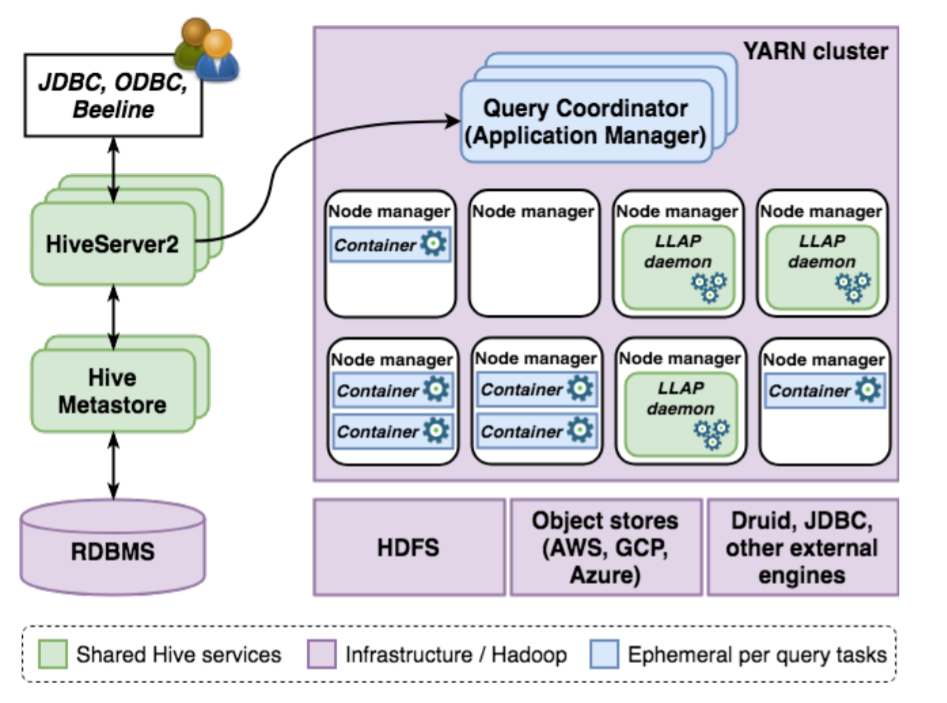
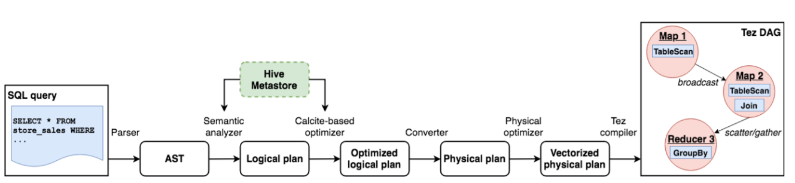

# Hive
---
## Введение

__Apache Hive__ — это система управления базами данных (СУБД) на основе платформы Apache Hadoop, предназначенная для хранения, обработки и анализа больших объемов данных в распределенной среде. Hive предоставляет SQL-подобный язык запросов HiveQL, позволяющий пользователям писать запросы, агрегировать и анализировать данные, хранящиеся в распределенной файловой системе Hadoop (HDFS) или в Apache HBase, без необходимости программировать на Java или создавать задания MapReduce вручную.

---

## Основные характеристики и функции Apache Hive:

- Позволяет работать с большими наборами данных, используя привычный SQL-подобный интерфейс, что облегчает анализ и обработку данных для специалистов, знакомых с SQL.
- HiveQL-запросы транслируются в задания MapReduce, Apache Tez или Spark, которые выполняются в распределенной среде Hadoop.
- Hive использует схему на чтение (schema on read), позволяя работать с неструктурированными и структурированными данными, определяя структуру данных при выполнении запросов.
- Включает компоненты для управления метаданными (Hive Metastore), для выполнения запросов и интеграции с другими инструментами Hadoop (например, HCatalog, WebHCat).
- Поддерживает расширение через пользовательские функции (UDF, UDAF, UDTF).
- Используется для пакетной обработки данных и подходит для аналитики больших объемов данных, часто применяя параллельную обработку.

---

## Архитектура системы



*На схеме представлены основные компоненты работы приложения Apache Hive*

__Хранение данных.__ Данные в Hive могут храниться в любом из поддерживаемых форматов файлов в любой файловой системе (в основном HDFS), совместимой с Hadoop. На сегодняшний день наиболее распространенными форматами файлов являются ORC и Parquet. Кроме того, Hive также может считывать и записывать данные в другие автономно используемые системы обработки, например, HBase и др.

__Каталог данных.__ Hive хранит всю информацию о своих источниках данных с помощью метастора Hive (HiveMetaStore). В двух словах, метастор - это каталог для всех данных, запрашиваемых Hive. Он использует СУБД для сохранения информации и полагается на DataNucleus, реализацию объектно-реляционного отображения Java, чтобы упростить поддержку нескольких СУБД. Для случаев, когда данные нужно получить быстро, Hive может напрямую обращаться к базе.

__Сменная среда обработки данных.__ Hive - это широко используемый SQL-движок от Hadoop. Изначально он использовал систему MapReduce, но со временем перешёл на более гибкую и быструю систему под названием Tez. Tez позволяет выполнять запросы быстрее, потому что строит план обработки данных в виде графа, где узлы — это шаги обработки, а связи между ними — это потоки данных. Это делает работу более гибкой и эффективной по сравнению с MapReduce. Кроме того, Tez хорошо работает с LLAP — специальной системой для кэширования и ускорения выполнения запросов.

---




*Этапы подготовки запроса в Hive*

При попадании пользовательского запроса в Hive, он обрабатывается драйвером, который строит логической план. После этого производится оптимизация логического плана (в том числе происходит обращение к метастору) который, в свою очередь, переводится в физический план (конкретные шаги по обработке данных: фильтрация, сортировка и тд.) и и если поддерживаются все операторы и выражения в плане, на его основе может быть сгенерирован векторизованный план. Дальше Hive разбивает план на задачи, которые можно выполнять параллельно. Эти задачи отправляются в YARN, где во время выполнения задачи обрабатывают входные данные конвейерным способом. После завершения выполнения, драйвер извлекает результаты запроса и возвращает их пользователю.

---

## Поддержка SQL и ACID в Hive

Hive поддерживает множество возможностей стандартного SQL. Он работает с различными типами данных (в том числе массивами и структурами), подзапросами, аналитическими функциями, операциями объединения и проверками целостности. Также сохраняется поддержка полезных для пользователей функций, например, разделения таблиц по значениям столбцов с помощью `PARTITIONED BY`, что позволяет ускорить запросы за счёт пропуска ненужных данных.

Ранее Hive позволял только добавлять или удалять целые разделы таблиц, но на данный момент он поддерживает полноценные SQL-операции: `INSERT`, `UPDATE`, `DELETE`, `MERGE`, обеспечивая поведение по стандарту ACID (атомарность, согласованность, изолированность, надёжность). Для этого используется механизм моментальных снимков и система транзакций, в которой каждая операция получает уникальный идентификатор. Обновления отслеживаются через специальные дельта-файлы, а удаления — как записи с пометками.

Hive хранит данные в отдельных каталогах: `base` — для основной версии, и `delta` — для новых/удалённых записей. При запросе читаются только актуальные данные, а дельта-файлы объединяются с основной версией.

Чтобы поддерживать производительность, Hive периодически запускает уплотнение (compaction) — объединяет файлы, удаляет устаревшие данные и уменьшает нагрузку на файловую систему.

---

## Оптимизация запросов

Hive изначально имел простые правила оптимизации (упрощение фильтров, удаление неиспользуемых столбцов, пропуск разделов), но это было недостаточно для сложных запросов. Поэтому в современных версиях используется *Apache Calcite* — гибкий оптимизатор на основе правил и затрат, который превращает запрос в несколько этапов переписывания и оценки стоимости, последовательно применяя группы правил (перестановка соединений, сворачивание операций, распространение предикатов и т. д.).

- Статистика, хранящаяся в метасторе (количество строк, разные значения, min/max, HyperLogLog++ для кардинальности), помогает точнее оценивать объёмы данных и выбирать лучший план.

- Повторная оптимизация

Если во время выполнения план оказался неэффективным (неправильно выбраны алгоритмы соединения или объём памяти), Hive автоматически повторяет компиляцию с учётом фактических временных метрик и других настроек, улучшая надёжность и производительность.

- Кэш результатов

HS2 хранит результаты ранее выполненных детерминированных запросов, сопоставляя их AST-дереву и снимкам таблиц. При совпадении запрос может сразу вернуть данные из кэша, избегая повторной работы.

- Материализованные представления

Hive поддерживает их создание и автоматическую подстановку в запросы. Оптимизатор переписывает запросы, чтобы использовать полные или частичные представления, опираясь на информацию о ключах и ограничениях. Для актуальности представления могут обновляться инкрементно или полностью по команде `REBUILD`.

- Совместная работа

Hive находит одинаковые подвыражения внутри одного запроса, вычисляет их один раз и переиспользует результаты, что сокращает дублирование работы.

- Динамическая обрезка полусоединений

При соединении фактов и измерений Hive сначала вычисляет фильтрованное подмножество одной таблицы, а затем на его основе пропускает ненужные данные в остальных. Если таблица партиционирована по ключу, ненужные разделы просто не читаются; иначе строятся диапазонный и Bloom-фильтр, которые отбрасывают лишние строки на этапе чтения.

Пример запроса (выглядит как обычный sql):
```sql
SELECT ss_customer_sk, SUM(ss_sales_price) AS sum_sales
FROM store_sales, store_returns, item
WHERE ss_item_sk = sr_item_sk AND
ss_ticket_number = sr_ticket_number AND
ss_item_sk = i_item_sk AND
i_category = 'Sports'
GROUP BY ss_customer_sk
ORDER BY sum_sales DESC;
```


---

## Выполнение запроса

С переходом от тяжеловесного MapReduce на Apache Tez и внедрением векторизованных операторов чтения столбцов задержки выполнения Hive уже сократились в разы, но для настоящей интерактивности потребовались ещё более глубокие изменения. Во-первых, запуск каждого запроса в новых YARN-контейнерах создавал ощутимые накладные расходы, во-вторых, JIT-компиляция терялась при уничтожении этих контейнеров, а в-третьих, повторные чтения одних и тех же данных приводили к лишним затратам ввода-вывода.

Решением стал LLAP (Live Long and Process) — набор постоянно работающих daemons (демонов) на узлах кластера, которые заранее резервируют память и CPU через YARN и без остановки обрабатывают потоки запросов. Их «лифт ввода-вывода» в отдельных потоках читает файлы пакетами, сразу преобразует их во внутренний сжатый столбцовый формат и пропускает в векторизованный движок, а встроенный кэш блоков «строка–столбец» удерживает часто используемые данные и метаданные, минуя дисковое чтение при повторных запросах. Поскольку демоны не хранят состояние, любая нода может подхватить обработку при отказе другой, а за счёт постоянных процессов JIT-компиляция остаётся живой.

Дополнительно Hive обладает менеджером рабочей нагрузки, который распределяет запросы по пулам LLAP-ресурсов согласно заранее заданным планам, выделяя CPU/память, задавая правила перемещения медленных заданий и позволяя одновременно обслуживать и быстрые аналитические запросы, и фоновые задачи, не создавая конфликтов между ними.

---

## Объединённая система хранения

Hive может использоваться как интерфейс для запросов к нескольким СУБД одновременно. Это упрощает разработку: приложения работают через один интерфейс, не завися от конкретных СУБД. Hive также помогает перемещать и преобразовывать данные между системами, управлять доступом и вести аудит (с помощью Ranger, Sentry, Atlas).

Обработчики хранения в Hive позволяют подключать внешние движки. Для этого реализуется интерфейс, включающий:

* как считывать и писать данные,
* как сериализовать и десериализовать их,
* как интегрироваться с Hive Metastore.

После настройки Hive может прозрачно обращаться к внешней СУБД, например, к Apache Druid. Чтобы начать работу, достаточно создать внешнюю таблицу в Hive с указанием источника Druid — столбцы и метаданные подтягиваются автоматически.

```sql
CREATE EXTERNAL TABLE druid_table_1
STORED BY 'org.apache.hadoop.hive.druid.DruidStorageHandler'
TBLPROPERTIES ('druid.datasource' = 'my_druid_source');
```

Ускорение вычислений с Calcite: Hive может переносить часть вычислений во внешнюю систему. Например, если таблица хранится в Druid, Hive преобразует SQL-запрос в JSON-запрос, понятный Druid, с помощью движка оптимизации Calcite. Это позволяет выполнять часть работы ближе к данным, повышая производительность.


---

**Использованные ресурсы**

[Apache Hive: от модели распределённых вычислений MapReduce компании Google до Big Data – хранилища больших данных (Habr)](https://habr.com/ru/articles/585460/)