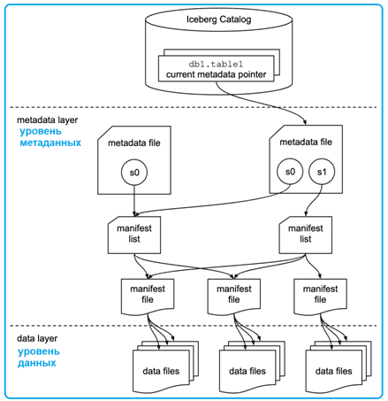

# ICEBERG

---

## Введение

**Apache Iceberg** — это открытый формат таблиц, разработанный для управления и эффективной обработки больших массивов аналитических данных, которые хранятся в озерах данных (Data Lake). Он не является системой хранения или движком обработки, а задает спецификацию для организации файлов данных (например, Parquet, Avro, ORC) и метаданных таким образом, чтобы обеспечить функциональность, близкую к традиционным базам данных, поверх объектных хранилищ (например, Amazon S3).

Iceberg предоставляет своим пользователям множество возможностей, в частсности:

- Транзакционная согласованность между несколькими приложениями, при которой можно добавлять, удалять или изменять файлы, при этом опреации чтения и записи изолированы друг от друга

- Отслеживание изменений в таблице с течением времени

- Time travel для запроса исторических данных или конкретной версии таблицы

- Изменение разделов, позволяющее обновлять схемы разделов по мере изменения запросов и объёмов данных без необходимости использования скрытых разделов или физических каталогов

- Откат к предыдущим версиям для быстрого устранения проблем и возвращения таблиц в исправное состояние

- Расширенные возможности планирования и фильтрации для повышения производтельности при работе с Big Data

---

## Архитектура Iceberg

Архитектура Apache Iceberg логически разделена на несколько уровней, что обеспечивает его гибкость и расширяемость.

1. Слой каталога (Iceberg Catalog). Это точка входа для любого движка обработки данных, такого как Trino или Spark. Каталог отвечает за сопоставление имени таблицы с раположением её текущего файла метаданных. Iceberg поддерживает различные реализации каталогов, включая Hive MetaStore, AWS Glue Catalog, JDBC и REST-каталоги, что обеспечивает широкую совместимость.

2. Слой метаданных (Metadata Layer). Это ядро Apache Iceberg. В отличие от Hive, который полагается на один центральный Metastore, Iceberg использует древовидную структуру метаданных.

- Файл метаданных (Metadata file). Корневой файл, содержащий информацию о схеме таблицы, спецификации партиционирования, снапшотах и расположении текущего списка манифестов.

- Список манифестов (Manifest list). Файл, который содержит указатели на один или несколько файлов манифеста. Каждый снапшот таблицы соответствует одному списку манифестов.

- Файл манифеста (Manifest file). Файл, содержащий список файлов данных (data files), а таке статистику по ним (например, минимальные и максимальные значения для столбцов), что используется для оптимизации запросов и отсечения ненужных файловю

3. Слой данных (Data Layer). Это фактические файлы с данными, хранящиеся в объектном хранилище. Iceberg поддерживает несколько форматов файлов, включая Parquet, ORC, Avro. Данные организованы в соответствии со структурой, описанной в файлах манифеста.

---

## Отличие Iceberg от традиционных катлогов и БД

Между Iceberg и каталогами данных Data Lake, такими как Hive MetaStore, а также реаляционными БД и КХД есть существенные различия. В отличие от Hive MetaStore в Iceberg приложения являются равноправными участниками процесса, сразу несколько инструментов могут напрямую и одновременно обновлять таблицы. Кроме того, Iceberg описывает полную историю таблиц, включая изменения схемы и данных. Hive MetaStore описывает только текущую схему набора данных, не предоставляя информацию об изменениях данных с течением времени.

Реляционные БД и КХД используют закрытые, вертикально интегрированные и проприетарные системы, в которых весь доступ к данным предоставляется через базу данных и обрабатывается ею же. Организацию доступа к данным через единую систему упрощает управление обновлениями данных, но при этом сильно ограничивает гибкость системы. Iceberg, напротив, позволяет всем приложениям работать с таблицами напрямую. Это не только снижает стоимость за счёт использования всех преимуществ архитектуры Data Lake, но и значительно повышает гибкость и оперативность системы, поскольку все приложения могут работать с наборами данных напрямую, не реорганизовывая данные между несколькими отдельными закрытыми системами.

Iceberg хранит сами записи и их метаданные в объектном хранилище. Это позволяет легко менять систему хранения или аналитический движок без потерь и неудобств для пользователей. Хотя Iceberg тоже использует файловую структуру (файлы метаданных и манифеста), она управляется на уровне метаданных: каждая фиксация на любой временной шкале сохраняется как событие на уровне данных при их добавлении. Уровень метаданных управляет списком моментальных снимков. Кроме того, он поддерживает интеграцию с несколькими механизмами запросов, а параллельные фиксации одних и тех же наборов данных обеспечивают атомарность транзакций с оптимистичным контролем параллелизма.

Любое обновление или удаление на уровне данных создает новый снимок на уровне метаданных из предыдущего последнего snapshot’а и параллельно связывает его, обеспечивая более быструю обработку запроса, поскольку запрос, предоставленный пользователями, извлекает данные на уровне файла, а не на уровне раздела. Изменения схемы и раздела в существующей таблице отслеживаются как отдельные компоненты в моментальных снимках на уровне метаданных. При изменении раздела Apache Iceberg сохраняет предыдущий и последний разделы как отдельные планы. При SQL-запросе к старым данным, Apache Iceberg выполняет план разделения и извлекает данные с разными разделами из нескольких моментальных снимков.

Iceberg использует модель запросов на основе моментальных снимков, в которой файлы данных сопоставляются с использованием файлов манифеста и метаданных. Даже при масштабном росте данных, SQL-запросы к этим таблицам обеспечивают высокую производительность, поскольку данные доступны на уровне файлов. А эти сопоставления хранятся в каталоге Iceberg. Таким образом, Iceberg поддерживает эволюцию схемы данных, упрощая добавление, переименование и изменение порядка имен столбцов. Изменения схемы данных никогда не требуют перезаписи всей таблицы, поскольку имена столбцов однозначно идентифицируются в слое метаданных с помощью идентификаторов, а не имени самого столбца.

Кроме того, разделы в Apache Iceberg динамические. Например, если в таблице присутствует столбец времени события (отметка времени, timestamp), таблица может быть разделена по дате из этого столбца. Apache Iceberg управляет взаимосвязью между timestamp-столбцом времени события и датой. Можно выполнить дополнительные уровни разделения, которые будут привязаны к моментальному снимку через файлы метаданных.

---

**Преимущества использования Iceberg**

Использование Iceberg для решения задач, касающихся организации данных в Data Lake обладает рядом преимуществ:

- Несколько независимых приложений могут обрабатывать один и тот же набор данных одновременно, обеспечивается безопасность параллельной записи в один и тот же набор данных

- ETL конвейеры обработки данных значительно упрощают работу с данными, находящимися в Data Lake. Благодаря отслеживанию изменений и поддержке версионности, данные можно безопасно перемещать и обрабатывать между разными инструментами без конфликтов.

- Изменение модели данных "на лету", без лишних перегрузок данных

- Версионирование данных после каждого изменения

---

### Использованные ресурсы

[Что такое Apache Iceberg? Ключевые характеристики и основные преимущества](https://datafinder.ru/products/chto-takoe-apache-iceberg-klyuchevye-harakteristiki-i-osnovnye-preimushchestva)

[Блеск и нищета каталогов метаданных для Data Lake: преимущества Apache Iceberg над Hive](https://bigdataschool.ru/blog/iceberg-vs-hive-in-data-lake/)

[Apache Iceberg](https://bigdataschool.ru/wiki/apache-iceberg/)