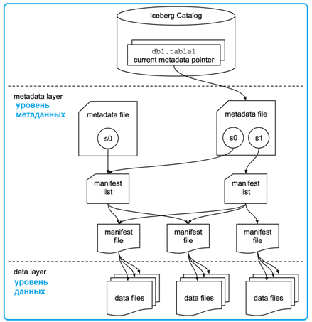

# ICEBERG

---

## Введение

**Apache Iceberg** — это открытый формат таблиц, разработанный для управления и эффективной обработки больших массивов аналитических данных, которые хранятся в озерах данных (Data Lake). Он не является системой хранения или движком обработки, а задает спецификацию для организации файлов данных (например, Parquet, Avro, ORC) и метаданных таким образом, чтобы обеспечить функциональность, близкую к традиционным базам данных, поверх объектных хранилищ (например, Amazon S3).

Iceberg предоставляет своим пользователям множество возможностей, в частсности:

- Транзакционная согласованность между несколькими приложениями, при которой можно добавлять, удалять или изменять файлы, при этом опреации чтения и записи изолированы друг от друга

- Отслеживание изменений в таблице с течением времени

- Time travel для запроса исторических данных или конкретной версии таблицы

- Изменение разделов, позволяющее обновлять схемы разделов по мере изменения запросов и объёмов данных без необходимости использования скрытых разделов или физических каталогов

- Откат к предыдущим версиям для быстрого устранения проблем и возвращения таблиц в исправное состояние

- Расширенные возможности планирования и фильтрации для повышения производтельности при работе с Big Data

---

## Архитектура Iceberg



Архитектура Apache Iceberg логически разделена на несколько уровней, что обеспечивает его гибкость и расширяемость.

1. Слой каталога (Iceberg Catalog). Это точка входа для любого движка обработки данных, такого как Trino или Spark. Каталог отвечает за сопоставление имени таблицы с раположением её текущего файла метаданных. Iceberg поддерживает различные реализации каталогов, включая Hive MetaStore, AWS Glue Catalog, JDBC и REST-каталоги, что обеспечивает широкую совместимость.

2. Слой метаданных (Metadata Layer). Это ядро Apache Iceberg. В отличие от Hive, который полагается на один центральный Metastore, Iceberg использует древовидную структуру метаданных.

- Файл метаданных (Metadata file). Корневой файл, содержащий информацию о схеме таблицы, спецификации партиционирования, снапшотах и расположении текущего списка манифестов.

- Список манифестов (Manifest list). Файл, который содержит указатели на один или несколько файлов манифеста. Каждый снапшот таблицы соответствует одному списку манифестов.

- Файл манифеста (Manifest file). Файл, содержащий список файлов данных (data files), а таке статистику по ним (например, минимальные и максимальные значения для столбцов), что используется для оптимизации запросов и отсечения ненужных файловю

3. Слой данных (Data Layer). Это фактические файлы с данными, хранящиеся в объектном хранилище. Iceberg поддерживает несколько форматов файлов, включая Parquet, ORC, Avro. Данные организованы в соответствии со структурой, описанной в файлах манифеста.

---

## Отличие Iceberg от традиционных каталогов и БД

Между Iceberg и каталогами данных Data Lake, такими как Hive MetaStore, а также реаляционными БД и КХД есть существенные различия. В отличие от Hive MetaStore в Iceberg приложения являются равноправными участниками процесса, сразу несколько инструментов могут напрямую и одновременно обновлять таблицы. Кроме того, Iceberg описывает полную историю таблиц, включая изменения схемы и данных. Hive MetaStore описывает только текущую схему набора данных, не предоставляя информацию об изменениях данных с течением времени.

Реляционные БД и КХД используют закрытые, вертикально интегрированные и проприетарные системы, в которых весь доступ к данным предоставляется через базу данных и обрабатывается ею же. Организацию доступа к данным через единую систему упрощает управление обновлениями данных, но при этом сильно ограничивает гибкость системы. Iceberg, напротив, позволяет всем приложениям работать с таблицами напрямую. Это не только снижает стоимость за счёт использования всех преимуществ архитектуры Data Lake, но и значительно повышает гибкость и оперативность системы, поскольку все приложения могут работать с наборами данных напрямую, не реорганизовывая данные между несколькими отдельными закрытыми системами.

Iceberg хранит сами записи и их метаданные в объектном хранилище. Это позволяет легко менять систему хранения или аналитический движок без потерь и неудобств для пользователей. Хотя Iceberg тоже использует файловую структуру (файлы метаданных и манифеста), она управляется на уровне метаданных: каждая фиксация на любой временной шкале сохраняется как событие на уровне данных при их добавлении. Уровень метаданных управляет списком моментальных снимков. Кроме того, он поддерживает интеграцию с несколькими механизмами запросов, а параллельные фиксации одних и тех же наборов данных обеспечивают атомарность транзакций с оптимистичным контролем параллелизма.

Любое обновление или удаление на уровне данных создает новый снимок на уровне метаданных из предыдущего последнего snapshot’а и параллельно связывает его, обеспечивая более быструю обработку запроса, поскольку запрос, предоставленный пользователями, извлекает данные на уровне файла, а не на уровне раздела. Изменения схемы и раздела в существующей таблице отслеживаются как отдельные компоненты в моментальных снимках на уровне метаданных. При изменении раздела Apache Iceberg сохраняет предыдущий и последний разделы как отдельные планы. При SQL-запросе к старым данным, Apache Iceberg выполняет план разделения и извлекает данные с разными разделами из нескольких моментальных снимков.

Iceberg использует модель запросов на основе моментальных снимков, в которой файлы данных сопоставляются с использованием файлов манифеста и метаданных. Даже при масштабном росте данных, SQL-запросы к этим таблицам обеспечивают высокую производительность, поскольку данные доступны на уровне файлов. А эти сопоставления хранятся в каталоге Iceberg. Таким образом, Iceberg поддерживает эволюцию схемы данных, упрощая добавление, переименование и изменение порядка имен столбцов. Изменения схемы данных никогда не требуют перезаписи всей таблицы, поскольку имена столбцов однозначно идентифицируются в слое метаданных с помощью идентификаторов, а не имени самого столбца.

Кроме того, разделы в Apache Iceberg динамические. Например, если в таблице присутствует столбец времени события (отметка времени, timestamp), таблица может быть разделена по дате из этого столбца. Apache Iceberg управляет взаимосвязью между timestamp-столбцом времени события и датой. Можно выполнить дополнительные уровни разделения, которые будут привязаны к моментальному снимку через файлы метаданных.

---

## Преимущества использования Iceberg

Использование Iceberg для решения задач, касающихся организации данных в Data Lake обладает рядом преимуществ:

- Несколько независимых приложений могут обрабатывать один и тот же набор данных одновременно, обеспечивается безопасность параллельной записи в один и тот же набор данных

- ETL конвейеры обработки данных значительно упрощают работу с данными, находящимися в Data Lake. Благодаря отслеживанию изменений и поддержке версионности, данные можно безопасно перемещать и обрабатывать между разными инструментами без конфликтов.

- Изменение модели данных "на лету", без лишних перегрузок данных

- Версионирование данных после каждого изменения

---

## Подходы к изменению данных

### Copy-on-Write (CoW)

Кратко можно описать подход как "мгновенная уборка".

В режиме Copy-on-Write при обновлении или удалении даже одной строки в файле данных Iceberg полностью перезаписывает весь файл.

Например, есть файл данных объемом 1 ГБ и вам нужно обновить всего одну запись, создается совершенно новый файл объемом 1 ГБ, содержащий все неизмененные записи плюс одну измененную.

Затем новый снимок состояния (snapshot) указывает на этот новый файл, а старый файл становится неактуальным.

Это может показаться неэффективным, но такая логика преследует конкретную цель. Благодаря поддержке полных файлов данных, отражающих текущее состояние, COW избавляет запросы на чтение от необходимости выполнять какие-либо операции сверки или слияния. Когда запросу нужно считать данные, он может обращаться к файлам напрямую, не проверяя наличие обновлений или удалений в других местах.

Copy-on-Write предлагает чёткий компромисс:

- **Производительность чтения:** Запросы выполняются быстрее, так как они читают файлы данных напрямую без дополнительной обработки. Нет необходимости проверять отдельные файлы удалений (delete files) или объединять обновления.

- **Производительность записи:** Операции обновления и удаления проходят медленне, так как требуют перезаписи целых файлов даже при незначительных изменениях. Это может существенно снизить производительность, если у вас большие файлы или частые модификации данных.

Для поддержания оптимальной производительности таблиц CoW необходима регулярная компакция (процесс перезаписи и слияния мелких файлов в более крупные и оптимизированные файлы - в данном случае Parquet - для повышения эффективности). Это помогает управлять размерами файлов и предотвращает накопление множества мелких фрагментов, которые могут замедлить выполнение запросов.

---

### Merge-on-Read (MoR)

Кратко можно охарактеризовать как ведение списка предстоящих изменений.

Вместо немедленной перезаписи файлов данных при возникновении изменений, Merge-on-Read использует продуманную комбинацию файлов удалений (delete files) и инкрементальных обновлений. Когда мы удаляем запись, Iceberg вообще не трогает исходный файл данных. Вместо этого он создаёт небольшой файл удалений, который, по сути, говорит системе игнорировать эту (удалённую ранее) запись в при чтении, хотя физически эта запись всё ещё существует.

Аналогично, при обновлении записи Iceberg создаёт файл удалений, чтобы пометить старую версию как неактуальную, и записывает только обновлённую версию в новый файл данных.

Этот метод значительно ускоряе операции записи, так как мы записываем только сами изменения, а не перезаписываем файлы целиком. Однако, здесь есть некоторый компромисс: при выполнении запроса к данным Iceberg приходится выполнять дополнительные действия. Ему необходимо проверить файлы удалений и объединить эти изменения с исходными данными, чтобы получить актуальное состояние данных.

#### Типы файлов удалений

- **Позиционные файлы удалений** (Positional Delete Files): в них хранится точное местоположение удалённых записей в конкретных файлах.

- **Файлы удалений по совпадению** (Equality Delete Files): в них хранятся значения удалённых записей; они работают скорее как описание того, что именно нужно удалить.

В то время как позиционные файлы удаления эффективны при чтении, но медленнее при записи, удаления по совпадению записываются быстрее, но требуют больше вычислительных ресурсов при чтении.

#### Производительность MoR

Основа поддержания высокой производительности таблиц MoR - регулярная компакция. Со временем, по мере накопления изменений в файлах удалений и появления новых файлов данных, скорость выполнения запросов может начать снижаться. Компакция помогает, периодически объединяя все эти изменения с базовыми файлами, создавая свежий и  оптимизированный набор файлов данных.

#### Когда выбирать MoR

Merge-on-Read лучше всего проявляет себя в сценариях, где критически важна скорость записи. Если приложению необходимо обрабатывать частые обновления или удаления, особенно в режиме реального или близкого к реальному времени, MoR будет лучшим выбором. Типичные варианты включают ведение профилей пользователей, обработку потоковых обновлений и управление любыми часто меняющимися данными.

---

### Преимущества удалений по совпадению (Equality Deletes)

Удаления по совпадению - это мощный способ обработки операций удаления в таблицах Iceberg версии 2 (v2), особенно полезный в сценариях Merge-on-Read.

В отлчие от метода отслеживания конкретных позиций записей, удаления по совпадению работают за счёт идентификации строк на основе их значений. Например, при удалении записи с определённым id заказа, файл удаления по совпадению просто сохраняет само условие (например, "удалить там, где id = 1234"), вместо того, чтобы выяснять, в каком именно файле и на каком месте находится эта запись.

Каждому файлу данных и файлу удаления в Iceberg присваивается порядковый номер (**sequence number**). При удалении записи файл удаления получает более высокий порядковый номер, чем у существующих файлов данных. Это гарантирует, что более новые записи (появившиеся позже) не будут ошибочно удалены, даже если они соответствуют критериям удаления, заданным для старых данных.

---

## Оптимизации Iceberg таблиц

### Установка порядка записи

Работая с таблицами, обычно считается, что порядок строк не играет важной роли. Однако, при работе с Iceberg, одной из фич является сбор статистик, позволяющий отсекать ненужные data файлы на этапе чтения манифеста. При чтении данных Iceberg активно использует min/max значения колонок в каждом manifest файле. Если значения min/max находятся вне диапазона значений нашего фильтра - файл нет необходимости читать.

Пример записи данных без порядка записи.

Создадим таблицу

```python
spark.sql("""
CREATE TABLE habr.paper.write_ordered (
  id INT,
  name STRING,
  event STRING
)
USING ICEBERG
""")
```

Произведём типичную ETL операцию с repartition

```python
data = [(i, f"name_{i}", f"event_{i}") for i in range(1, 1000000)]

df = spark.createDataFrame(data, ["id", "name", "event"]).repartition(16)

df.writeTo("habr.paper.write_ordered").append()
```

Теперь посмотрим содержимое manifest file с помощью запроса

```python
spark.sql("""
SELECT readable_metrics.id.lower_bound AS id_min,
    readable_metrics.id.upper_bound AS id_max, file_path 
FROM habr.paper.write_ordered.files
""").show(truncate=False)
```

Увидим такой результат

```python
+------+------+-------------------------------------------------------------------------------------------------+
|id_min|id_max|file_path                                                                                        |
+------+------+-------------------------------------------------------------------------------------------------+
|2     |999994|s3://habr/paper/write_ordered/data/-9fb24ce9ff63-0-00001.parquet|
|43    |999988|s3://habr/paper/write_ordered/data/00001-267-cc7ac11e-62e9-4f59-a2f6-9fb24ce9ff63-0-00001.parquet|
|4     |999997|s3://habr/paper/write_ordered/data/00002-268-cc7ac11e-62e9-4f59-a2f6-9fb24ce9ff63-0-00001.parquet|
|8     |999961|s3://habr/paper/write_ordered/data/00003-269-cc7ac11e-62e9-4f59-a2f6-9fb24ce9ff63-0-00001.parquet|
|1     |999944|s3://habr/paper/write_ordered/data/00004-270-cc7ac11e-62e9-4f59-a2f6-9fb24ce9ff63-0-00001.parquet|
|25    |999983|s3://habr/paper/write_ordered/data/00005-271-cc7ac11e-62e9-4f59-a2f6-9fb24ce9ff63-0-00001.parquet|
|39    |999991|s3://habr/paper/write_ordered/data/00006-272-cc7ac11e-62e9-4f59-a2f6-9fb24ce9ff63-0-00001.parquet|
|23    |999998|s3://habr/paper/write_ordered/data/00007-273-cc7ac11e-62e9-4f59-a2f6-9fb24ce9ff63-0-00001.parquet|
|33    |999985|s3://habr/paper/write_ordered/data/00008-274-cc7ac11e-62e9-4f59-a2f6-9fb24ce9ff63-0-00001.parquet|
|10    |999999|s3://habr/paper/write_ordered/data/00009-275-cc7ac11e-62e9-4f59-a2f6-9fb24ce9ff63-0-00001.parquet|
|15    |999990|s3://habr/paper/write_ordered/data/00010-276-cc7ac11e-62e9-4f59-a2f6-9fb24ce9ff63-0-00001.parquet|
|40    |999986|s3://habr/paper/write_ordered/data/00011-277-cc7ac11e-62e9-4f59-a2f6-9fb24ce9ff63-0-00001.parquet|
|35    |999996|s3://habr/paper/write_ordered/data/00012-278-cc7ac11e-62e9-4f59-a2f6-9fb24ce9ff63-0-00001.parquet|
|13    |999951|s3://habr/paper/write_ordered/data/00013-279-cc7ac11e-62e9-4f59-a2f6-9fb24ce9ff63-0-00001.parquet|
|3     |999981|s3://habr/paper/write_ordered/data/00014-280-cc7ac11e-62e9-4f59-a2f6-9fb24ce9ff63-0-00001.parquet|
|5     |999969|s3://habr/paper/write_ordered/data/00015-281-cc7ac11e-62e9-4f59-a2f6-9fb24ce9ff63-0-00001.parquet|
+------+------+-------------------------------------------------------------------------------------------------+
```

Отсюда видно, что делая любой запрос с фильтрацией по `id`, мы с высокой долей вероятности прочитаем все файлы, не задействуя фичи Iceberg.

Однако, Iceberg поддерживает сортировки при записи данных

```python
spark.sql("""
ALTER TABLE habr.paper.write_ordered
WRITE ORDERED BY id
""")
```

Теперь выполняя ту же ETL операцию получим такой результат

```python
+------+------+-------------------------------------------------------------------------------------------------+
|id_min|id_max|file_path                                                                                        |
+------+------+-------------------------------------------------------------------------------------------------+
|1     |196479|s3://habr/paper/write_ordered/data/00000-245-e7a312b9-83fd-4805-9260-fb0a7cb1b5d4-0-00001.parquet|
|196480|395983|s3://habr/paper/write_ordered/data/00001-246-e7a312b9-83fd-4805-9260-fb0a7cb1b5d4-0-00001.parquet|
|395984|595114|s3://habr/paper/write_ordered/data/00002-247-e7a312b9-83fd-4805-9260-fb0a7cb1b5d4-0-00001.parquet|
|595115|793943|s3://habr/paper/write_ordered/data/00003-248-e7a312b9-83fd-4805-9260-fb0a7cb1b5d4-0-00001.parquet|
|793944|999999|s3://habr/paper/write_ordered/data/00004-249-e7a312b9-83fd-4805-9260-fb0a7cb1b5d4-0-00001.parquet|
+------+------+-------------------------------------------------------------------------------------------------+
```

За счёт этой оптимизации при чтении данных с фильтрацией по колонке id, например `id < 196000`, мы прочитаем один файл, опираясь на min/max статистику, вместо того, чтобы читать все имеющиеся файлы.

---

### Отключение расчёта статистик

По умолчанию Iceberg собирает статистику для каждого столбца в каждом файле. Это помогает избегать лишнего чтения (как в предыдущем пункте), но также сбор такой статистики занимает некоторое время и создаёт нагрузку на систему.

Рассмотрим плоскую таблицу в lakehouse хранилище.

```python
spark.sql("""
CREATE TABLE habr.paper.typical_flat_table (
  id INT,
  name STRING,
  col_1 STRING,
  col_2 STRING,
  col_3 STRING,
  col_4 STRING,
  col_5 STRING,
  col_6 STRING,
  col_7 STRING,
  col_8 STRING
)
USING ICEBERG
""")
```

В ней 10 столбцов, однако для аналититических запросов будут использоваться только 2 первых столбца, соответственно, статистика для оставшихся 8 колонок бесполезна.

Для того, чтобы это исправить, необходимо вручную настроить расчёт статистик. Iceberg позволяет установить сбор метрик по умолчанию (для примера выбрано `count`). Также рекомендуется установить уровень сбора метрик для конкретного столбца. Так, для `id`, который используется в запросах, рекомендуется выставить уровень `full`, а для колонок, по которым не идёт никакая фильтрация данных, отключить сбор статистик.

```python
spark.sql("""
ALTER TABLE habr.paper.typical_flat_table SET TBLPROPERTIES (
    -- По умолчанию собираем только счетчики
    'write.metadata.metrics.default' = 'counts',
    -- Для критически важного столбца ID собираем полные границы
    'write.metadata.metrics.column.id' = 'full',
    -- Для неиспользуемого в фильтрации столбца col_1 не собираем статистики
    'write.metadata.metrics.column.col_1' = 'none'
)
""")
```

---

### Векторизованное удаление

Известны стратегии Copy-on-Write (CoW) и Merge-on-Read (MoR). Так, используя Merge-on-Read, фактически происходит перекладывание вычислительной нагрузки на читателя. В этот момент ключевым фактором производительности становится то, как именно движок вычитывает удалённые строки из основного массива данных.

Iceberg поддерживает 2 основных вида Delete файлов.

- **Equality delete** - используется в streaming обработке. По сути, в delete файл просто записывается "правило удаления", которое применяется во время чтения данных.

- **Position delete** - используется в батчевой обработке, delete файл содержит номера строк, которые нужно удалить.

Содержание **Position delete** файла

```python
+------------------------------------------+---+
|file_path                                 |pos|
+------------------------------------------+---+
|s3://habr/paper/mor_table/data/....parquet|873|
|s3://habr/paper/mor_table/data/....parquet|230|
|s3://habr/paper/mor_table/data/....parquet|992|
+------------------------------------------+---+
```

С внедрением Iceberg format v3 в спецификации произошли изменения. Во-первых, **Equality delete** был признан Deprecated, а **Position delete** эволюционировал в **Deletion vectors** за счёт внедрения Puffin файлов.

**Deletion vector** - это bitmap, который за один такт применяется к пашему data файлу, что существенно оптимизирует чтение при MoR.

Таким образом, вместо того, чтобы применять тяжеловесный join delete файла и data файла, вычислительный движок просто загружае битовую маску и применяет её, производя всего одну логическую операцию при вычислении.

---

### Использованные ресурсы

[Что такое Apache Iceberg? Ключевые характеристики и основные преимущества](https://datafinder.ru/products/chto-takoe-apache-iceberg-klyuchevye-harakteristiki-i-osnovnye-preimushchestva)

[Блеск и нищета каталогов метаданных для Data Lake: преимущества Apache Iceberg над Hive](https://bigdataschool.ru/blog/iceberg-vs-hive-in-data-lake/)

[Apache Iceberg](https://bigdataschool.ru/wiki/apache-iceberg/)

[Неочевидные оптимизации Iceberg таблиц](https://habr.com/ru/articles/1013956/)

[Merge-on-Read vs Copy-on-Write in Apache Iceberg](https://olake.io/iceberg/mor-vs-cow/)
