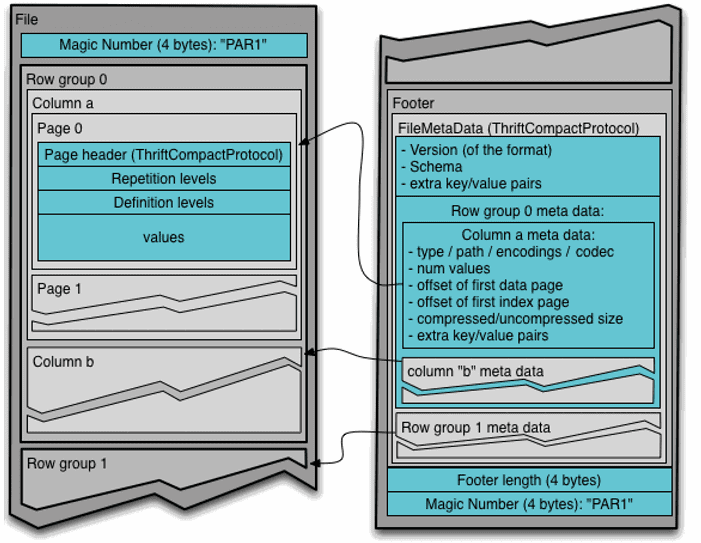
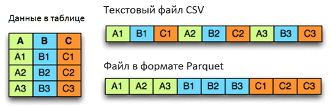
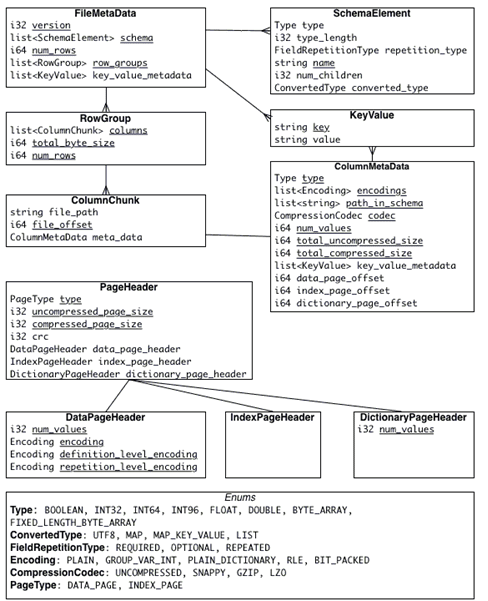

# PARQUET

---

## Введение

**Apache Parquet** – это бинарный, колоночно-ориентированный формат хранения больших данных, изначально созданный для экосистемы Hadoop, позволяющий использовать преимущества сжатого и эффективного колоночно-ориентированного представления информации. Паркет позволяет задавать схемы сжатия на уровне столбцов и добавлять новые кодировки по мере их появления. Вместе с Apache Avro, Parquet является очень популярным форматом хранения файлов Big Data и часто используется в Kafka, Spark и Hadoop.

---

## Структура файла Parquet

Одной из ключевых особенностей этого формата является использование уровней определения (definition levels) и уровней повторения (repetition levels), которые позволяют оптимально хранить пустые значения и эффективно кодировать данные, информацию о схеме в метаданных.

Уровни определения определяют количество необязательных полей в пути для столбца. Уровни повторения указывают для какого повторяемого поля в пути значение имеет повторение. Максимальные уровни определения и повторения могут быть вычислены из схемы. Эта степень вложенности определяет максимальное количество битов, необходимых для хранения уровней. В свою очередь, уровни определены для всех значений в столбце.

Благодаря многоуровневой системе разбиения файлов на части реализуется параллельное исполнение операций с данными (MapReduce, ввод/выводб кодирование, сжатие).

- Row-group - логическое горизонтально разбиение данных на строки для распараллеливания работы на уровне MapReduce. Не существует физической структуры, которая гарантирована для группы строк. Группа строк состоит из фрагмента столбца для каждого столбца в наборе данных.

- Column chunk - блок данных для столбца в определённой группе строк - разбиение для распределения операций ввода-вывода на уровне колонок, оптимизирует работу с жёстким диском, записывая данные не по строкам, а по колонкам.

- Page - концептуально неделимая единицаю С точки зрения сжатия и кодирования - разбиение колонок на страницы для распределения работ по кодированию и сжатию данных. Страницы содержат метаинформацию и закодированные данные.

*Структура файла формата Apache Parquet*

---

## Типы и представления данных в формате Parquet

Иерархически файл Parquet состоит из одной или нескольких групп строк. Группа строк содержит ровно один фрагментстолбца на столбец. Фрагменты столбцов содержат одну или несколько страниц.

Группы строк используются HDFS для реализации концепции локальности данных, когда каждый узел кластера считывает лишь ту информацию, которая хранится непосредственно на его жёстком диске.

В Apache Spark группа строк является единицей работы для каждой задачи. При этом группа строк помещается в память, что следует учитывать при настройке размера группы - каков минимальный объём памяти, выделяемый на задачу на самом слабом узле кластера. Чтобы разбить входные данные на несколько групп строк и эффективно распределить spark задачи по ресурсам кластера, можно использовать опервцию разделения RDD-таблиц, которые является основными объектами в Spark.

Поскольку типы данных влияют на объём занимаемого пространства, их стремятся минимизировать при проектировании форматов файла. Например, 16-разрядные числа явно не поддерживаются в формате хранения, поскольку они покрыты 32-разрядными числами с эффективным кодированием. Благодаря такой стратегии снижается сложность реализации чтения и записи формата.

Parquet поддерживает следующие типы:

- BOOLEAN - 1-битный логический.

- INT32 - 32-битные числа со знаком.

- INT64 - 64-битные числа со знаком.

- INT96 - 96-битные числа со знаком.

- FLOAT - IEEE 32-битные числа с плавающей точкой.

- DOUBLE - IEEE 64-разрядные значения с плавающей точкой.

- BYTE_ARRAY - байтовые массивы произвольной длины.

*Представление данных в формате Apache Parquet*

---

## Метаданные файла Parquet

Формат Parquet явно отделяет метаданные от данных, что позволяет разбивать столбцы на несколько файлов, а также иметь один файл метаданных, ссылающийся на несколько файлов parquet. Метаданные записываются после значящих данных, чтобы обеспечить однопроходную связь. Таким образом, сначала прочитаются метаданные файла, чтобы найти все нужные фрагменты столбцов, которые далее будут прочтены последовательно.

При повреждении метаданных сам файл теряется - это правило также актуально в случае столбцов и страниц.

- При повреждении метаданных столбца потеряется данный фрагмент столбца, но его фрагменты в других группах строк останутся неизменны.

- При повреждении заголовка страницы, остальные страницы в этом столбце также будут утеряны.

- Если данные на странице повреждены, эта страница теряется.

Таким образом, файл с небольшими группами строк является более устойчивым к повреждению. Однако, в этом случае размещение метаданных в конце файла будет проблемой, т.к. при возникновении сбоя при записи метаданных, все записанные данные станут нечитаемыми. Это можно исправить, записав метаданные файла в каждую N-ю группу строк. Метаданные каждого файла будут включать все группы строк, записанные на данные момент. Комбинируя это с маркерами синхронизации, можно восстановить частично записанные файлы.

*Метаданные файла Parquet*

---

### Использованные ресурсы

[Parquet](https://bigdataschool.ru/wiki/parquet/)