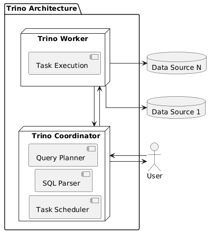

# TRINO

---

## Введение

**Trino** – это распределенная система обработки запросов, анализирующая данные из разных источников без необходимости их перемещения. Она работает как SQL-движок, позволяющий пользователям выполнять запросы к данным в разных форматах и хранилищах, используя стандартный SQL-синтаксис. 

Изначально создавался как замена Hive, но, в отличии от него, Trino реализует массивно-параллельную архитектуру, а промежуточные результаты в большинстве случаев "стримятся" между узлами без сохранения на диск, что делает движок существенно более производительным.

Сервис обладает возможностью подключения к разным источникам, включая Hive, Cassandra, S3, Kafka, MySQL, PostgreSQL, а также поддерживает множество форматов, включая CSV, Parquet, JSON, Avro. Подключившись к источнику данных с помощью коннектора, Trino выполняет операторы SQL, определенные в стандарте ANSI SQL из предложений, выражений и предикатов, и преобразует их в запросы, которые выполняются в распределенном кластере. Это позволяет анализировать информацию из источников в едином запросе, получая единую картину.

---

## Архитектура Trino

Кластер Trino состоит из одного координатора и может включать несколько рабочих узлов. Пользователи подключаются к координатору с помощью клиента, чтобы отправлять SQL-запросы и получать результаты.

### Координатор (Coordinator)

Координатор Trino — это сервер, который отвечает за разбор операторов, планирование запросов и управление рабочими узлами Trino. Это центральная точка кластера Trino, а также узел, к которому подключаются клиенты для отправки SQL-операторов на выполнение. Для разработки и/или тестирования можно настроить один экземпляр Trino для выполнения обеих ролей, т.е. и как координатор, и как рабочий узел. Координатор отслеживает активность каждого рабочего узла и координирует выполнение запроса. Он создает логическую модель запроса, включающую ряд этапов, транслируя ее в ряд связанных задач, выполняемых на рабочих узлах. Координаторы общаются с рабочими узлами и с клиентами с помощью REST API. Аналогично происходит взаимодействие рабочих узлов друг с другом.

### Рабочий узел (Worker)

Рабочий узел Worker — это сервер Trino, который отвечает за выполнение задач и обработку данных. Рабочие узлы извлекают данные из источников с помощью коннекторов и обмениваются друг с другом промежуточными данными. Координатор отвечает за извлечение результатов из рабочих и возврат конечных результатов клиенту. Когда запускается рабочий процесс Trino, он объявляет о себе серверу обнаружения в координаторе, что делает его доступным для выполнения задач.

*Архитектура Trino*

---

### Использованные ресурсы

[MPP-движок для Big Data: архитектура и принципы работы Trino](https://bigdataschool.ru/blog/news/what-is-trino/)